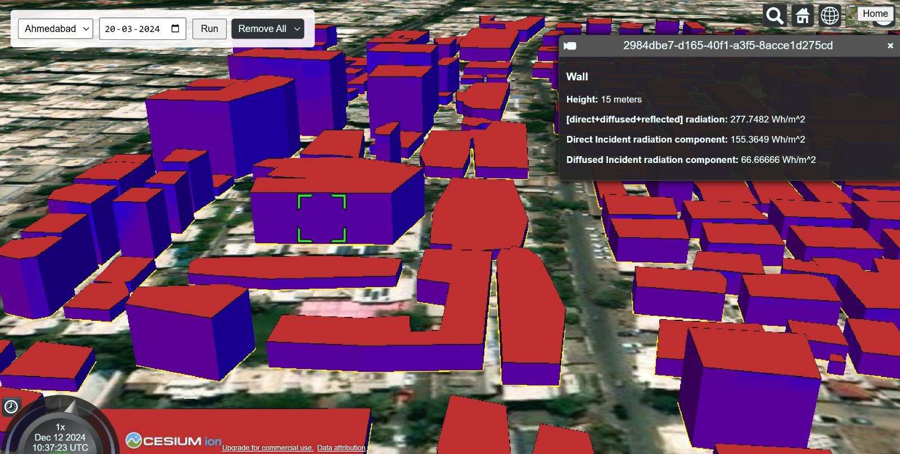

# City-Scale Wall Irradiance Estimation (LOD-1, Ray-Tracing Based)

---

This project computes the **total solar irradiance** (direct + diffuse + reflected) received by **each wall of every building** in a user-supplied city map. Using a shapefile as input, it constructs an **LOD-1 3D model** of all buildings, performs GPU-accelerated ray tracing to evaluate shading, and outputs **per-wall irradiance maps and heatmaps** for further visualization and solar potential analysis.

The pipeline is designed for **city-scale performance**, leveraging a **Bounding Volume Hierarchy (BVH)** and a **compute shader** for massively parallel shadow testing.

---

### **Visualization Preview**



The image above shows an example visualization of the application’s output rendered in **CesiumJS**.

This visualization is **not part of the repository**; it is simply a demonstration of how the generated **GeoJSON** files and **irradiance heatmap textures** can be used in external tools for interactive exploration.

## **Features**

- Converts 2D building footprints + height attributes into LOD-1 extruded 3D geometry
- Uses **ear-clipping triangulation** for polygon meshing
- Builds a **BVH acceleration structure** for fast ray–triangle intersection
- Incorporates **hourly EPW weather data** (irradiance + sun position)
- Performs **GPU-parallel ray tracing** via compute shaders
- Computes direct, diffuse, and reflected irradiance per building wall
- Generates **irradiance heatmaps** and **GeoJSON output** for visualization

---

# **1. Input**

### **1.1 Shapefile**

The shapefile must contain:

- Building footprints (2D polygons)
- A building height attribute

### **1.2 EPW Weather File**

The EnergyPlus Weather (EPW) file provides:

- Global Horizontal Irradiance (GHI)
- Diffuse Horizontal Irradiance (DHI)
- Direct Normal Irradiance (DNI)
- Solar azimuth and zenith angles
    
    These values are used per hour of the year.
    

---

# **2. Pipeline Overview**

### **Step 1 — Load Shapefile**

Extract:

- Building coordinates
- Polygon geometry
- Building height

### **Step 2 — Generate LOD-1 Geometry**

Each polygon is extruded to its height to create walls and roof faces.

Polygons are triangulated using **Ear Clipping Triangulation**, which runs in:

- **O(k²)** time for a polygon with k vertices
- **O(n)** overall for city data, since k is small and fixed per building

### **Step 3 — Build the BVH**

A **Bounding Volume Hierarchy** is constructed over all triangles.

Properties:

- **O(n)** memory usage
- **O(log n)** ray intersection queries
- Greatly accelerates ray tracing for shadow casting

### **Step 4 — Extract Hourly Irradiance & Sun Direction**

From the EPW file, per hour:

- GHI, DHI, DNI
- Sun direction vector

These determine:

- Whether a wall is sun-facing
- The amount of irradiance it can receive

### **Step 5 — Sample Points on Each Wall**

Walls are uniformly sampled.

The sampling density controls:

- The resolution of the heatmap
- The accuracy of shadow estimation

Each sampled point is sent to the compute shader.

### **Step 6 — GPU Compute Shader (Ray Tracing)**

A compute shader launches **one thread per sampled point**, performing:

1. Generate a ray at the point in the sun direction
2. Traverse the BVH
3. Detect if any building obstructs the ray

Outputs:

- Whether the point receives direct sunlight

### **Step 7 — Compute Irradiance per Wall**

For each hour, for each wall:

```
shadowFraction = numObstructedPoints / totalSamplePoints
cosTheta       = max(0, dot(outwardNormal, -sunDirection))

eDirect   = DNI * (1 - shadowFraction) * cosTheta
eDiffuse  = DHI * (1 + tiltFactor) / 2
eReflected = GHI * 0.2 * (1 - tiltFactor) / 2

totalIrradiance = eDirect + eDiffuse + eReflected
```

Diffuse and reflected irradiance use a standard isotropic sky model with a fixed ground albedo of 0.2.

### **Step 8 — Output Heatmaps + GeoJSON**

For each building face:

- Irradiance values at sampled points
- A texture (heatmap) visualizing irradiance distribution
- A GeoJSON file linking geometry to irradiance

This enables use in GIS tools, dashboards, or BIPV potential workflows.

---

# **3. Output**

- **Wall-wise irradiance values (W/m² or Wh/m²)**
- **Heatmap textures** for each wall
- **GeoJSON** with irradiance attributes

---

# **4. Limitations**

- Uses **LOD-1 geometry** only (no roofs with slopes, balconies, overhangs)
- **Trees and vegetation are not modeled**
- Uses an **isotropic diffuse model** and fixed ground albedo
- Shadowing considers only building geometry

---

# **5. Technologies Used**

- C# (Unity or .NET)
- Compute shaders (HLSL)
- BVH acceleration structure
- Ear clipping triangulation
- EPW weather file parser
- GIS libraries (QGIS) for shapefile processing

---

# **6. Future Work**

- Add tree geometry and vegetation occlusion
- Integrate LOD-2 or LOD-3 building models
- Support anisotropic sky models (Perez, Hay-Davies)
- Incorporate multiple reflections or radiosity
- Improve sampling adaptively based on geometry

---